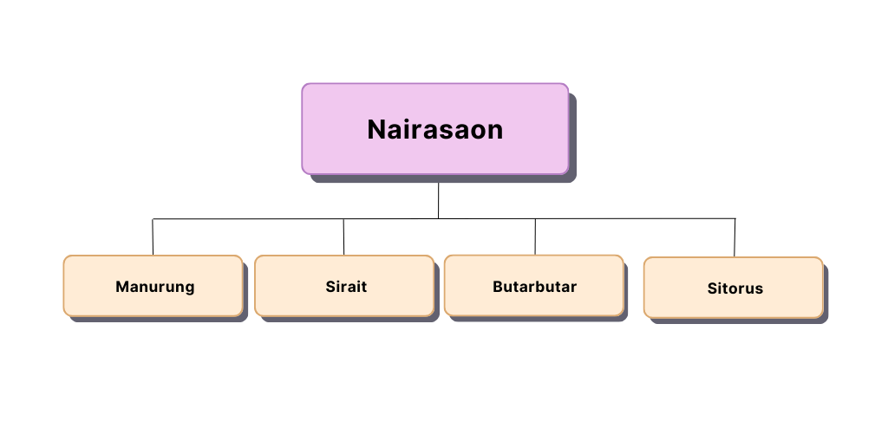

## Soal-Post-Test PBO

Seorang pria ingin memperkenalkan calon istrinya kepada keluarganya. Namun, dalam keluarga mereka, terdapat aturan tentang anggota baru dalam keluarga mereka.

1. Jika marga ayahnya sama dengan marga ayah pria tersebut maka mereka tidak dapat menikah.
   
2. Jika marga ibunya sama dengan marga ibu pria tersebut maka mereka tidak dapat menikah.
   Berdasarkan marga keluarga mereka, tolong periksa apakah mereka dapat menikah atau tidak.
   
   <br>
Berdasarkan marga keluarga mereka, tolong periksa apakah mereka dapat menikah atau tidak.
<br>
Pada input terdapat empat segment yaitu input pertama mendeskripsikan `marga ayah pria`, input kedua mendeskripsikan `marga ayah kekasih`, input ketiga mendeskripsikan `marga ibu pria` dan input keempat mendeskripsikan `marga ibu kekasih`. Kedua input tersebut menggunakan kecil/_lowercase_ dengan tipe data `string`. Program akan menentukan apakah pria dan kekasihnya dapat menikah atau tidak dalam bentuk 1 baris luaran(output) **Yes** or **No**.
<br>

**Perhatikan format struktur input :**

```
marga ayah pria
marga ayah kekasih
marga ibu pria
marga ibu kekasih

```

**Perhatikan format struktur output :**
```
Keputusan menikah atau tidak

```

<hr>

#### Example 1:

Berikut adalah contoh masukan yang diberikan.

```
sitorus
pardede
situmorang
tampubolon

```

Berikut adalah keluaran yang diharapkan.

```
yes

```

#### Example 2:

Berikut adalah contoh masukan yang diberikan.

```
sitorus
pardede
situmorang
pardede

```

Berikut adalah keluaran yang diharapkan.

```
no

```
