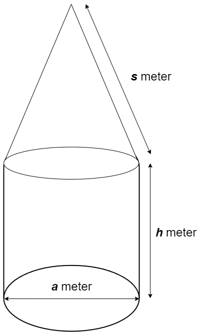

## Soal-Post-Test PEMPROS

Suatu hari, seorang anak muda yang bernama Butet diminta untuk membuat miniatur menara kecil dari lego dengan menggunakan lego yang seadanya. Untuk menyelesaikan tugas tersebut, Ucok perlu mengetahui volume menara tersebut. Berikut adalah bentuk menaranya:

Bantulah Ucok dengan membuat kalkulator sederhana untuk menghitung volume bangun ruang tersebut!
Keterangan input:

1. Input pertama mendeskripsikan panjang sisi `a` dengan satuan meter.
2. Input kedua mendeskripsikan panjang sisi `h` dengan satuan meter.
3. Input kedua mendeskripsikan panjang sisi `s` dengan satuan meter.
4. Kedua Input bertipe data `int`.
   Perhatikan format struktur input :

```
a
h
s

```

Keterangan output:

1. bertipe data `int`.
   Perhatikan format struktur input :

```
Volume bangun ruang

```

<hr>

Berikut adalah contoh masukan yang diberikan.

```
60
40
50

```

Berikut adalah keluaran yang diharapkan.

```
240

```
