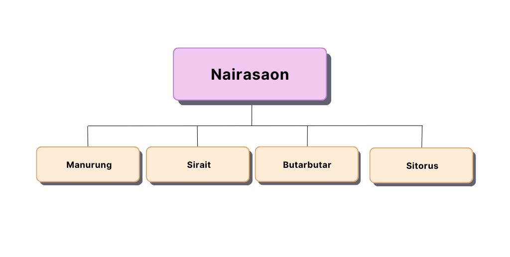

## Soal-Pre-Test PBO

Seorang pria ingin memperkenalkan kekasihnya kepada keluarganya. Namun, keluarga mereka memiliki aturan tentang penerimaan anggota baru dalam keluarga mereka. Dimana teraturan tersebut, jika marga ayahnya sama dengan marga ayah pria maka mereka tidak dapat menikah. Adapun yang termasuk dari marga ayah si pria adalah sebagai berikut :

Berdasarkan marga keluarga mereka, tolong periksa apakah mereka dapat menikah atau tidak.
<br>
Keterangan input:

1. Input pertama mendeskripsikan `marga ayah pria`.
2. Input kedua mendeskripsikan `marga ayah kekasih`.
3. Kedua Input bertipe data `string`.
4. Kedua Input menggunakan hurup kecil/_lowercase_.
   Perhatikan format struktur input :

```
marga ayah pria
marga ayah kekasih

```

Keterangan output:

1. bertipe data `String`.
1. menggunakan hurup kecil/_lowercase_.
   Perhatikan format struktur output :

```
Keputusan menikah atau tidak

```

<hr>

#### Example 1:

Berikut adalah contoh masukan yang diberikan.

```
pardede
sitorus

```

Berikut adalah keluaran yang diharapkan.

```
yes

```

#### Example 2:

Berikut adalah contoh masukan yang diberikan.

```
pardede
pardede


```

Berikut adalah keluaran yang diharapkan.

```
no

```
