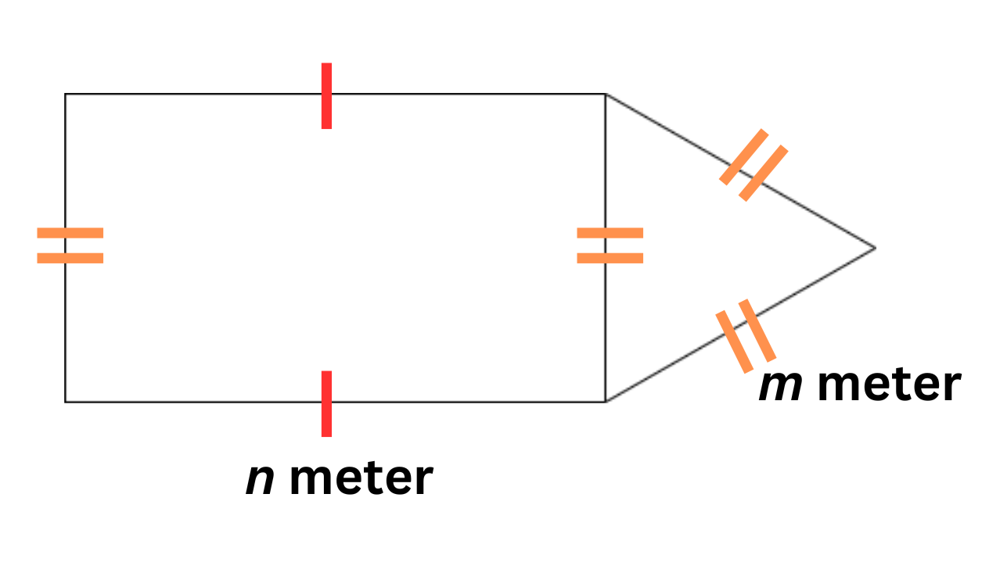

## Soal-Pre-Test PEMPROS

Suatu hari, seorang anak muda yang bernama Ucok diminta untuk membuat miniatur rumah kecil dengan menggunakan bahan yang seadanya. Untuk menyelesaikan tugas tersebut, Ucok perlu mengetahui keliling rumah tersebut. Berikut adalah bentuk rumahnya:

Bantulah Ucok dengan membuat kalkulator sederhana untuk menghitung keliling bangun tersebut!

Keterangan input:

1. Input pertama mendeskripsikan panjang sisi `n` dengan satuan meter.
2. Input kedua mendeskripsikan panjang sisi `m` dengan satuan meter.
3. Kedua Input bertipe data `int`.


Perhatikan format struktur input :

```
n
m

```

Keterangan output:

1. bertipe data `int`.

Perhatikan format struktur output :

```
Keliling Bangun

```

<hr>

#### Example :

Berikut adalah contoh masukan yang diberikan.

```
30
40

```

Berikut adalah keluaran yang diharapkan.

```
180

```
